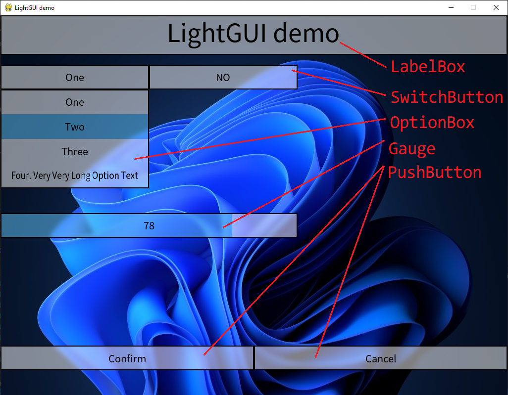

# PyGame LightGUI
PyGame GUI elements with gaussian blur effects.

## Current Progress
### Elements
- LabelBox
- SwitchButton
- OptionBox
- Gauge
- PushButton

### Demo
demo.py

## Dependencies
tested with pygame-ce 2.5.2

## References
pygame ui elements: https://github.com/Rabbid76/PyGameExamplesAndAnswers/blob/master/documentation/pygame/pygame_ui_elements.md#menu